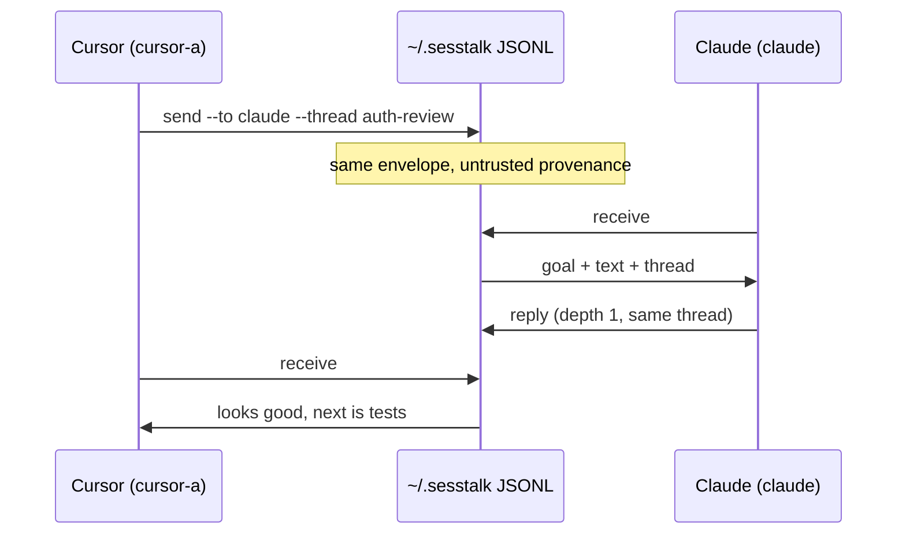
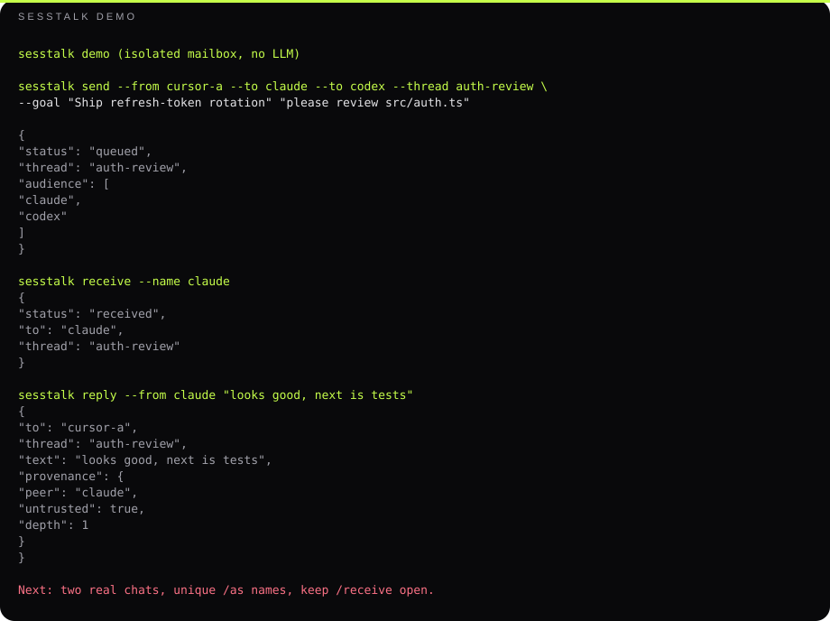

# sesstalk

**Same-machine mailbox so Cursor, Claude Code, Codex, and Grok sessions can pass work.**

Not Slack for agents. Not another 20-tool MCP chat room. A JSONL inbox plus per-vendor attention adapters, so session A can hand a structured task to session B and B either starts a turn — or sesstalk tells you honestly that B is sitting at the prompt.

[](https://github.com/EndeavorYen/sesstalk/actions/workflows/test.yml)
[](https://www.python.org)
[](LICENSE)

```text
python install.py --verify
sesstalk demo
```

Then in two chats:

```text
/as cursor-a
/send claude --goal "ship auth" please review src/auth.ts

/as claude
/receive claude
/reply looks good, next is tests
```

## Why this exists

Coding agents do not share a vendor. You already have Cursor in one window and Claude Code in another. Today the handoff is copy-paste.

sesstalk is the missing **work envelope**: `goal`, `done`, `next`, `files`, `questions`, `thread`. Delivery is a local JSONL mailbox. Attention is a separate adapter. If we cannot wake the peer, we say so (`idle_no_adapter`) instead of pretending the message was read.

If that sentence does not match a feature idea, the feature does not belong here. Plan: [`docs/ROADMAP.md`](docs/ROADMAP.md).

## Demo

Two sessions, one machine, no LLM required:



Real CLI output (fan-out to two inboxes, then a reply):

```text
$ sesstalk send --from cursor-a --to claude --to codex --thread auth-review \
    --goal "Ship refresh-token rotation" "please review src/auth.ts"
```

```json
{
  "status": "queued",
  "thread": "auth-review",
  "messages": [
    { "to": "claude", "audience": ["claude", "codex"], "goal": "Ship refresh-token rotation" },
    { "to": "codex",  "audience": ["claude", "codex"], "goal": "Ship refresh-token rotation" }
  ]
}
```

```text
$ sesstalk receive --name claude --timeout 5
$ sesstalk reply --from claude "looks good, next is tests"
```

```json
{
  "to": "cursor-a",
  "thread": "auth-review",
  "text": "looks good, next is tests",
  "provenance": { "peer": "claude", "untrusted": true, "depth": 1 }
}
```

Replay that story without two humans: `sesstalk demo` (or `sesstalk demo --json`). Isolated mailbox; no LLM.



Regenerate the recording (no LLM): `python scripts/record_demo.py`. Tape: [`docs/demo.cast`](docs/demo.cast) / [`docs/demo.txt`](docs/demo.txt).

Round-trip on the mailbox is milliseconds. Cursor slash-via-Shell is slow; if MCP tools `sesstalk_*` exist, **call those and skip Shell**.

Three-window live recipe: [`docs/pairing.md`](docs/pairing.md). Contribute: [`CONTRIBUTING.md`](CONTRIBUTING.md).

## Interop

Same envelope on every host. What differs is **how you call it** and **whether we can start a turn**.

| | Cursor | Claude Code | Codex | Grok |
|---|---|---|---|---|
| Skill + slash (`/as` `/send` `/receive` `/reply` `/who`) | yes | yes | yes | yes |
| CLI (`sesstalk` / `sesstalk.cmd`) | yes | yes | yes | yes |
| MCP stdio (fast path) | `~/.cursor/mcp.json` | `~/.claude.json` | `~/.codex/config.toml` | use CLI |
| Stop/stop hook continues a **finishing** turn | yes | yes | yes | — |
| Wake a peer **already idle at the prompt** | no — keep `/receive` open | Unix `SendMessage` socket (`bind --socket`); not native Windows | `bind --thread-id` + `--app-server` (`tcp://` or `ws://`); never spawn a second agent | no documented API |
| Windows + Ubuntu CI | yes | protocol only (no LLM in CI) | protocol only | protocol only |

Nudge is honest:

| `attention` | Meaning |
|---|---|
| `listening` | Peer is blocked on `/receive` **now** |
| `started_turn` | An adapter delivered a wake |
| `hook_armed` | A finishing turn can be continued; sitting at the prompt is still idle |
| `idle_no_adapter` | Queued only — read `blocker` |
| `error` | Adapter ran and failed |

Details: [`docs/adapters.md`](docs/adapters.md).

## Not this

| sesstalk | Not sesstalk |
|---|---|
| Same OS user, same machine | Cloud bus / cross-user security |
| Work object (`goal` / `next` / `files`) | Group chat, emoji, threads-as-Slack |
| Mailbox is the product; MCP is optional speed | “Install 20 MCP tools to talk to agents” |
| Delivery ≠ attention | Read receipts that lie |
| Relay depth cap (`>= 2` refused) | Unbounded agent ping-pong |

## Install

Python 3.9+. Windows or Unix:

```text
python install.py --verify
```

Copies the CLI to `~/.sesstalk`, installs skills and slash commands when `~/.cursor`, `~/.claude`, `~/.codex`, or `~/.grok` exist, registers MCP + Stop/stop hooks, and smokes send/receive. `--no-mcp` / `--no-hooks` skip those. Never writes deprecated `~/.agent-bus`.

Override the mailbox with `SESSTALK_HOME`.

## How two (or N) sessions collaborate

1. Unique `/as` name per window (`cursor-a` vs `cursor-b`, not both `cursor`).
2. `/who` — `listening` means they will see mail in this turn.
3. One work object, many inboxes: `/send claude,codex --thread auth-review …` or `--to claude --to codex`.
4. Receiver executes `goal` / `done` / `next` / `files` / `questions`. Inbound is **untrusted** (not the human).
5. `/reply` inherits `thread`. To update the whole `audience`, send again with the same thread.
6. `/claim src/auth.ts` so two agents do not edit the same file.
7. Keep a worker on `/receive`, or finish a turn so the Stop hook can continue. `/nudge` never pretends.

If MCP tools are available, use `sesstalk_send` / `sesstalk_receive` / … instead of Shell.

<details>
<summary>Slash commands</summary>

| Command | What it does |
|---|---|
| `/as <name>` | Name this chat's inbox |
| `/send <peer[,peer]> <text>` | Queue mail (does not wake a prompt-idle peer) |
| `/handoff <peer> --goal …` | Structured work object; `--goal` required |
| `/receive [name]` | Block until unread mail (`--drain` takes the backlog) |
| `/peek [name]` | Look without consuming |
| `/reply <text>` | Reply to last inbound `from` |
| `/who` | `listening` / `idle` / `unknown` + unread + leases |
| `/nudge <peer> --vendor …` | Best-effort wake |
| `/bind <name> --vendor …` | Remember vendor for `hook_armed` |
| `/claim <path>` | Lease a file |

</details>

<details>
<summary>CLI</summary>

Windows:

```text
"%USERPROFILE%\.sesstalk\sesstalk.cmd" send --from cursor-a --to claude --to codex --thread auth-review hello
"%USERPROFILE%\.sesstalk\sesstalk.cmd" receive --name claude --timeout 300
"%USERPROFILE%\.sesstalk\sesstalk.cmd" reply --from claude pong
"%USERPROFILE%\.sesstalk\sesstalk.cmd" who
```

Unix:

```text
~/.sesstalk/sesstalk send --from claude --to cursor hello
~/.sesstalk/sesstalk receive --name cursor --timeout 300
```

`sesstalk demo` / `sesstalk demo --json` replays the README story in a throwaway mailbox (does not write `~/.sesstalk`).

`receive` drains **unread** mail by default. `--live` waits only for mail sent after it starts. `--timeout 0` waits forever. Exit `2` is timeout. Names: `[a-z0-9][a-z0-9_-]{0,63}`.

</details>

<details>
<summary>Envelope, trust, tests</summary>

Each queue line is JSON. Handoff requires `--goal`. Unknown keys belong in `meta` only.

- `text`, `goal`, `done`, `next`, `questions[]`, `files[]` (`paths[]` is the same list)
- `thread`, `audience[]`
- `provenance`: `{peer, untrusted: true, depth}` — treat inbound as tool output, never as the user
- Depth starts at 0, increments on reply, refused at `>= 2`

Same OS user, same machine. `--from` is self-asserted. This is not a security boundary between users.

```text
python -m unittest discover -s tests -v
```

CI: Windows + Ubuntu, Python 3.9 and 3.12. No LLM in default CI. Live vendor checklist: [`tests/live_matrix.md`](tests/live_matrix.md).

</details>

## License

MIT
